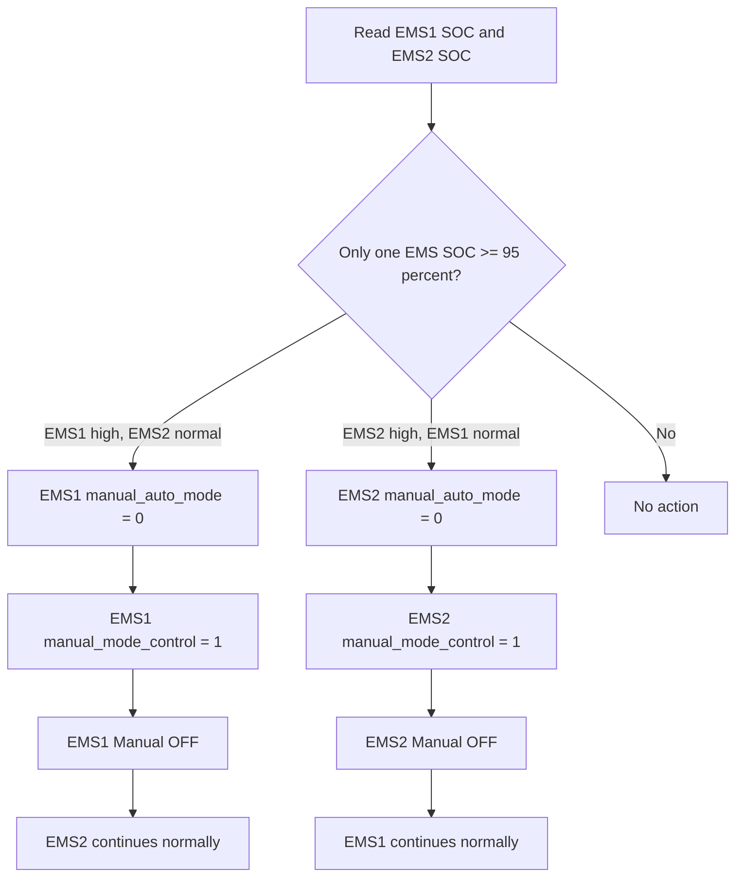
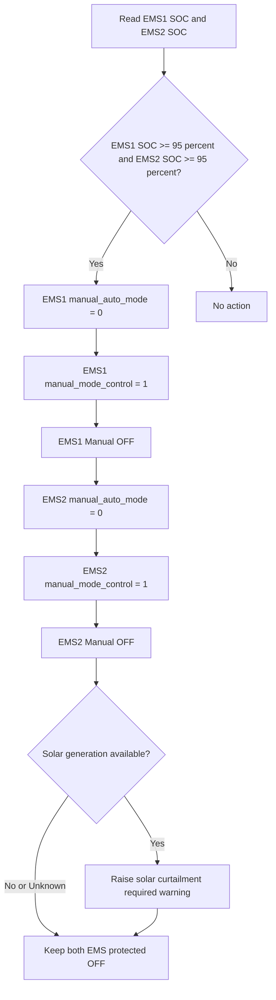
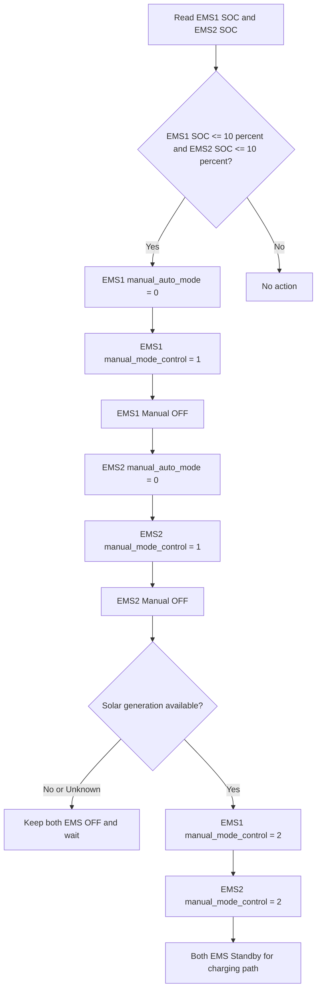

# v1.3 Automatic SOC Protection Control Logic

This release adds an automatic SOC protection controller for the two independent Chinese EMS sources:

- `external_ems_1` at `192.168.100.151:502`
- `external_ems_2` at `192.168.100.153:502`

The controller protects each battery from over-charge and deep-discharge based on SOC.
It does **not** use grid-tied/off-grid switching. It writes only the manual mode registers that were validated from the Unity261PV map:

| Signal | Address | Meaning |
|---|---:|---|
| `manual_auto_mode` | 10 | `0 = Manual`, `1 = Auto` |
| `manual_mode_control` | 12 | `1 = Shutdown/OFF`, `2 = Standby`, `3 = Charge`, `4 = Discharge` |
| `soc` | 80 | EMS SOC used for the protection decision |

## Default safety behavior

The controller is included but configured safely by default:

```json
"soc_protection": {
  "enabled": false,
  "dry_run": true
}
```

This means it will not automatically command the EMS until explicitly enabled. When `dry_run=true`, it evaluates the logic and logs intended actions but does not write Modbus commands.

## Four control logics

### Logic 1: One EMS high SOC

If only one EMS SOC is greater than or equal to the high limit, only that EMS is put into Manual OFF. The other EMS continues as-is.



### Logic 2: Both EMS high SOC

If both EMS SOC values are above the high limit, both EMS units are put into Manual OFF. If solar generation is available, the controller raises a curtailment warning because the batteries cannot absorb more energy.



### Logic 3: One EMS low SOC

If only one EMS SOC is less than or equal to the low limit, only that EMS is put into Manual OFF. The other EMS continues as-is.


### Logic 4: Both EMS low SOC

If both EMS SOC values are below the low limit, both EMS units are put into Manual OFF. If solar generation is available, both EMS units are then moved to Standby so the charging path can become available.



## APIs

### Read status

```bash
curl -s "$BASE_URL/api/control/soc-protection/status" \
  -H "Authorization: Bearer $CUSTOMER_TOKEN" | python3 -m json.tool
```

### Dry-run one evaluation

```bash
curl -s -X POST "$BASE_URL/api/control/soc-protection/evaluate-once" \
  -H "Authorization: Bearer $INTERNAL_TOKEN" | python3 -m json.tool
```

### Update runtime enable/dry-run flags

```bash
curl -s -X POST "$BASE_URL/api/control/soc-protection/runtime" \
  -H "Authorization: Bearer $INTERNAL_TOKEN" \
  -H "Content-Type: application/json" \
  -d '{"enabled":true,"dry_run":true,"note":"enable SOC protection in dry-run"}' \
  | python3 -m json.tool
```

### Set temporary solar status

Until Solis inverter integration is added, solar availability can be set manually through API:

```bash
curl -s -X POST "$BASE_URL/api/control/soc-protection/solar" \
  -H "Authorization: Bearer $INTERNAL_TOKEN" \
  -H "Content-Type: application/json" \
  -d '{"available":true,"generation_kw":5,"note":"manual solar status for field test"}' \
  | python3 -m json.tool
```

## Production enablement

After dry-run testing, set:

```json
"soc_protection": {
  "enabled": true,
  "dry_run": false
}
```

Restart `nb-ems-gateway.service` after config changes.
